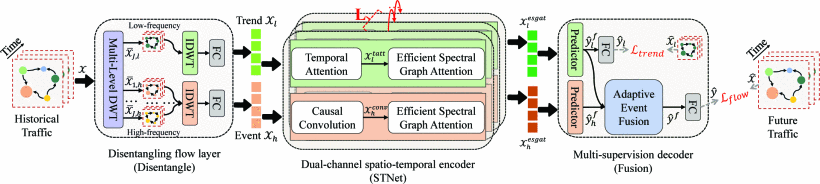

# [ICDE'2023] STWave

## 📖Introduction
This is a official PyTorch implementation of the paper: [When Spatio-Temporal Meet Wavelets: Disentangled Traffic Forecasting via Efficient Spectral Graph Attention Networks](https://ieeexplore.ieee.org/document/10184591).



[](https://paperswithcode.com/sota/traffic-prediction-on-pemsd3?p=when-spatio-temporal-meet-wavelets)
[](https://paperswithcode.com/sota/traffic-prediction-on-pemsd4?p=when-spatio-temporal-meet-wavelets)
[](https://paperswithcode.com/sota/traffic-prediction-on-pems07?p=when-spatio-temporal-meet-wavelets)
[](https://paperswithcode.com/sota/traffic-prediction-on-pemsd8?p=when-spatio-temporal-meet-wavelets)


## ⚡Environment
- PyTorch
- fastdtw
- PyWavelets

## 🔧 Data Preparation

### PeMSD3 & PeMSD4 & PeMSD7 & PeMSD8
- Download the data [PeMSD*](https://pan.baidu.com/share/init?surl=ZPIiOM__r1TRlmY4YGlolw) with code: p72z.
- Unzip them to corresponding folders.

### PeMSD7(M) & PeMSD7(L)
- Download the data [PeMSD7(M)](https://github.com/VeritasYin/STGCN_IJCAI-18/tree/master/data_loader).

- Email authors of STGCN to get the data PeMSD7(L).

### Data Shape
- flow.npz: [T, N, F] (**F** should be consistent with the **input_dims** in the config file)
- adj.npy: [N, N]


## 🚀 Run
Given the example of PeMSD8
```bash
mkdir ./cpt/PeMSD8
mkdir ./log/PeMSD8
python main.py --config config/PeMSD8.conf
```


## 💬Citation


If you find our work is helpful, please cite as:

```text
@inproceedings{fang2023spatio,
  title={When spatio-temporal meet wavelets: Disentangled traffic forecasting via efficient spectral graph attention networks},
  author={Fang, Yuchen and Qin, Yanjun and Luo, Haiyong and Zhao, Fang and Xu, Bingbing and Zeng, Liang and Wang, Chenxing},
  booktitle={2023 IEEE 39th International Conference on Data Engineering (ICDE)},
  pages={517--529},
  year={2023},
  organization={IEEE}
}
```

## 👍Contributing


We welcome contributions and suggestions!

